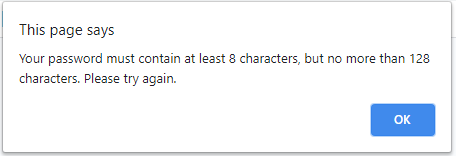

# pw-generator

## Description

This application is designed to generate a secure password using a randomizing method and including various character types.  

## Usage

The password generator is very simple to use. Simply click the red Generate Password button, and a series of prompts will appear to guide you through creating a secure password. Your password may include anywhere from 8 to 128 characters, and may incorporate any combination of special characters, numerical characters, uppercase characters, and lowercase characters. Of course, the greater variety of characters, the more secure your password will be! 

If you accidentally select the wrong amount of characters or wish to start over, the series of prompts can be completed as many times as you wish!

## License 

Copyright (c) [2021] [Greg Riss]

Permission is hereby granted, free of charge, to any person obtaining a copy
of this software and associated documentation files (the "Software"), to deal
in the Software without restriction, including without limitation the rights
to use, copy, modify, merge, publish, distribute, sublicense, and/or sell
copies of the Software, and to permit persons to whom the Software is
furnished to do so, subject to the following conditions:

The above copyright notice and this permission notice shall be included in all
copies or substantial portions of the Software.

THE SOFTWARE IS PROVIDED "AS IS", WITHOUT WARRANTY OF ANY KIND, EXPRESS OR
IMPLIED, INCLUDING BUT NOT LIMITED TO THE WARRANTIES OF MERCHANTABILITY,
FITNESS FOR A PARTICULAR PURPOSE AND NONINFRINGEMENT. IN NO EVENT SHALL THE
AUTHORS OR COPYRIGHT HOLDERS BE LIABLE FOR ANY CLAIM, DAMAGES OR OTHER
LIABILITY, WHETHER IN AN ACTION OF CONTRACT, TORT OR OTHERWISE, ARISING FROM,
OUT OF OR IN CONNECTION WITH THE SOFTWARE OR THE USE OR OTHER DEALINGS IN THE
SOFTWARE.